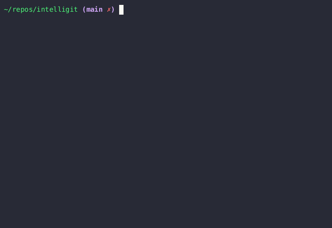

# Intelligit

> Intelligit is a tool that offers insight into your git repository by tracking changes to code symbols


[](https://crates.io/crates/intelligit)

## Capabilities

### Show symbols in status


### Find commits for a symbol


## How does it work
Intelligit uses [patterns](docs/PATTERN.md) to find meaningful symbols in the source code and tracks changes in the symbols. 
The patterns use [tree-sitter](https://github.com/tree-sitter/tree-sitter) to find symbols.

Intelligit has default patterns for
- Rust
- C#
- OCaml
- Toml
- Json
- Lua
- Typescript
- Javascript
- Go

Intelligit is extensible and adding new patterns is simple. See [patterns](docs/PATTERN.md) for creating your own patterns.

For everything related to git, [gitoxide](https://github.com/Byron/gitoxide) is used. 

## Installing

The easiest way to install Intelligit is to use ```cargo```

```
cargo install intelligit
```

*If you are using a pattern that does not use a precompiled parser, a C compiler is needed to compile the parser. 

## Integrating with other tools
Intelligit supports outputing json to make it easy to integrate with other tools.

Some projects
- [trulsma/intelligit.nvim](https://github.com/trulsma/intelligit.nvim)

## Project Status
Intelligit is currently in its early stages of development, and the project's direction is open to exploration.


## Contributions
If you have an idea or want to help please do :)

## Limitations

* Intelligit does not handle building the history on different branches. As of now intelligit is oblivious to branches.

## License
Intelligit is licensed under the [MIT License](LICENSE)
